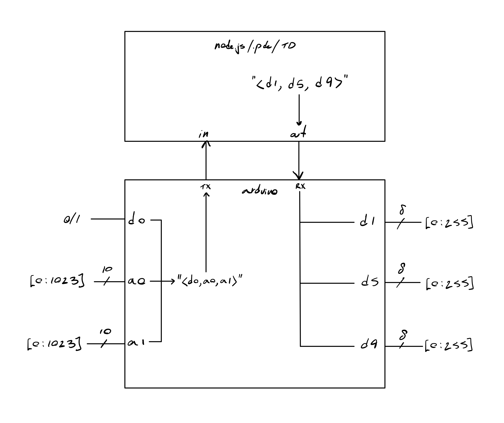
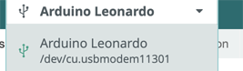
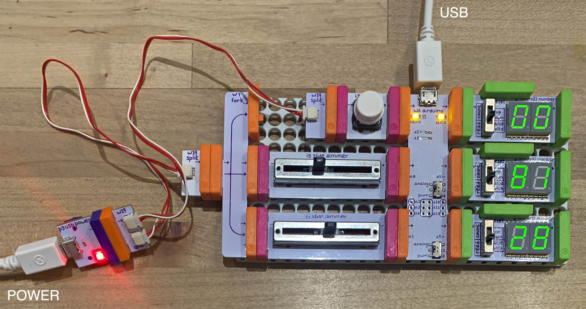
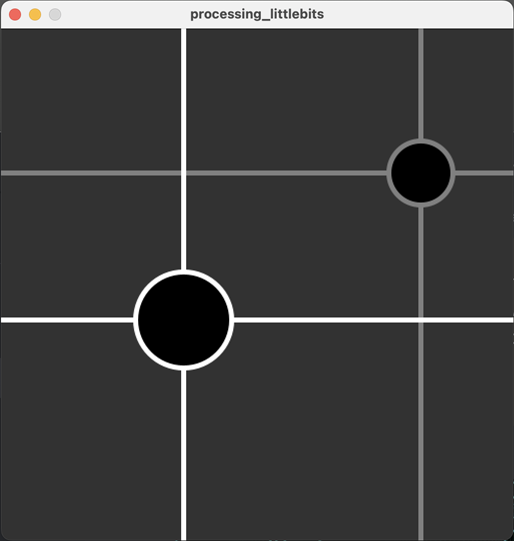

# p5-littleBits

Get data in and out of littleBits components via the littleBits Arduino and p5.js, Processing, or TouchDesigner.

## tldr : here's a block diagram of the system 


---

## First Steps: Clone this Repo

Fire up your favorite terminal, `cd` somewhere comfortable and clone this repository:

```
$ git clone https://github.com/yonmaor1/p5-littleBits.git
$ cd p5-littleBits
```

## Uploading the program to the littleBits Arduino

We will flash a special program onto the littleBits Arduino Bit. 

* Install the [Arduino IDE](https://www.arduino.cc/en/software). 
* Connect the LittleBits Arduino Bit to your computer's USB port. 
* Launch the Arduino IDE software. It may manage some additional installs the first time. 
* From Arduino IDE, open the file `p5-littleBits.ino`. 
* Make sure to select the "**Arduino Leonardo**" model of board in the pulldown menu. 
* From the pulldown menu, make a note of the *name* of your Arduino board's serial controller. For example, on my Mac, the name of my specific littleBits Arduino is `/dev/cu.usbmodem11301`. This ID varies from device to device. 
* In Arduino IDE menu: *Sketch > Verify/Compile* (Command-R)
* In Arduino IDE menu: *Sketch > Upload* (Command-U)



## Example littleBits Rig



*littleBits connections are as follows:*

**Input Sensors:**

* [littleBits button module (i3)](https://sphero.com/products/button) or other on/off sensor connected to `d0` on littleBits Arduino (upper left)
* [littleBits slide dimmer (i5)](https://sphero.com/products/slide-dimmer) or other continuously-valued sensor connected to `a0` on littleBits Arduino (middle left)  
* [littleBits slide dimmer (i5)](https://sphero.com/products/slide-dimmer) or other continuously-valued sensor connected to `a1` on littleBits Arduino (lower left)

**Output Actuators:**

 * [littleBits number display (o21)](https://sphero.com/products/number-bit) or other actuator connected to `d1` on littleBits Arduino (upper right)
 * littleBits number display (o21) connected to `d5` on littleBits Arduino (middle right)
 * littleBits number display (o21) connected to `d9` on littleBits Arduino (lower right)

**Other Connections and Settings:**

 * Output switches on littleBits Arduino are set to "analog" (not "pwm"). 
 * littleBits Arduino is connected via USB cable to computer USB port (at top). 
 * All sensors are powered, e.g. littleBits power (p3) connected via split cables (w19) etc. to button and sliders. 

---

## Instructions: littleBits + Processing (Java)

You can connect to the littleBits Arduino via Processing (Java). This allows you to use Processing to read values from littleBits sensors and to send signals to littleBits actuators (simultaneously, if desired). 

* If necessary, [download and install Processing](https://processing.org/download). This project is known to work with Processing 4.3.
* Run the program [processing_littlebits.pde](processing/processing_littlebits/processing_littlebits.pde).
* When the program starts, it will print out a list of available Serial port connections to the Processing console. Identify which of these is your specific littleBits Arduino board; for example, it may look something like `/dev/cu.usbmodem11301`. Count, starting with 0, the listed serial ports until you reach your littleBits Arduino, and place that number in the brackets (e.g. `[]`) in the command on line 42: `mySerialPort = new Serial(this, Serial.list()[1], 9600);`.
* You should be able to control the three output numbers with your mouse, and you should see a graphic indicator of the sliders' values. 




---

## Instructions: littleBits + p5.js

For p5.js to communicate with the littleBits Arduino over serial, we will need to run a Node.js server. 

Ensure you have [npm installed](https://docs.npmjs.com/downloading-and-installing-node-js-and-npm). You will need npm version 16.0.0 or higher.

Run: `$ npm install`

Ensure this worked by running: `$ npm list`

You should see something like this:

```
p5-littleBits@1.0.0 /path/to/p5-littleBits
├── body-parser@1.20.3
├── child_process@1.0.2
├── cors@2.8.5
├── express@4.21.1
└── serialport@12.0.0
```

To launch the program, run

```
$ node golive.js serialPortNumber
``` 

or for verbose output, 

```
$ node golive.js serialPortNumber -v
``` 

(If your Arduino is on serial port is `/dev/cu.usbmodem2101`, use `2101` as the number.)

and navigate to [http://localhost:8081/p5](http://localhost:8081/p5) in your favorite web browser.


---

#### TODO:

serial port disconnects on power surge (?)
```
Node.js Server Error: Error writing to serial port: ENXIO: no such device or address, write

Node.js Server Error: Error writing to serial port: ENXIO: no such device or address, write
Error writing to serial port: ENXIO: no such device or address, write
Error writing to serial port: ENXIO: no such device or address, write
Error writing to serial port: ENXIO: no such device or address, write

Node.js Server Error: Error: [Error: ENXIO: no such device or address, write] {
  errno: -6,
  code: 'ENXIO',
  syscall: 'write',
  disconnect: true
}
```
